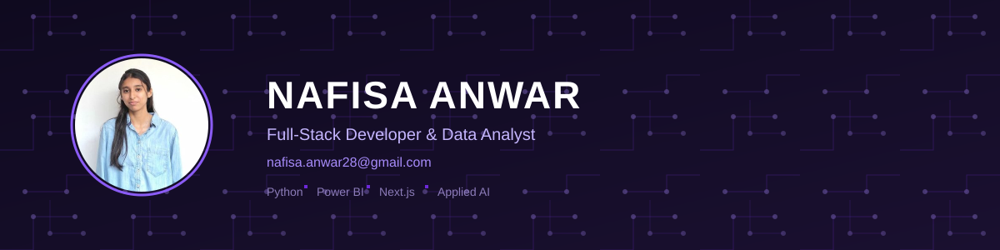

<div align="center">



</div>
<a href="https://git.io/typing-svg">
  
</a>


[](https://nafisa-portfolio-kappa.vercel.app)
[](https://linkedin.com/in/nafisa-anwar)
[](mailto:nafisa.anwar28@gmail.com)
[](https://github.com/Nafisa28)


</div>

---

## About Me

I'm a Computer Science Engineering student at Kalpataru Institute of Technology (KIT), building at the intersection of **full-stack engineering**, **data analytics**, and **applied AI**. I care about clean architecture, efficient system design, and turning raw data into decisions that matter.

Currently interning as a **Data Analyst at ElevanceSkills** and building a **Medical Operations Intelligence Dashboard** as part of the **Infosys Springboard Internship 7.0**, where I work on real-time healthcare analytics — from data pipelines to interactive geographic dashboards.

- 🔭 Engineering scalable, user-centric web applications with Next.js, Flask, and PHP
- 📊 Turning messy datasets into actionable dashboards with Python, Pandas, and Power BI
- 🤖 Exploring agentic AI, RAG pipelines, and LLM-powered tooling (MCP, LangChain)
- 🌱 Deepening my ML/AI fundamentals alongside product-focused engineering

**Open To:** Software Engineering Internships · Data Analyst roles · AI/ML collaborations · Open-source contributions

---

## Tech Stack

<div align="center">

**Languages**


**Frontend**


**Backend & Databases**


**Cloud, DevOps & Tooling**


</div>

---

## AI / ML Expertise

| Domain | Proficiency | Details |
|---|:---:|---|
| Data Analysis & Visualization | ⭐⭐⭐⭐☆ | Pandas, NumPy, Power BI, Plotly/Dash, EDA & pipeline design |
| Machine Learning | ⭐⭐⭐☆☆ | Scikit-learn, TensorFlow, PyTorch fundamentals |
| Applied Generative AI | ⭐⭐⭐⭐☆ | LangChain, RAG pipelines, MCP tool-calling architectures |
| Agentic AI Systems | ⭐⭐⭐☆☆ | Built an MCP server standardizing tool-calling across Gmail & Microsoft Graph |
| Geospatial Analytics | ⭐⭐⭐☆☆ | Folium, GeoPandas for facility/resource utilization mapping |

---

## Featured Projects

<details>
<summary><b>📧 Flymail — AI-Powered Email Management Platform</b></summary>

AI-powered platform to compose, refine, schedule, and send professional email through Gmail and Outlook, powered by Claude AI.

| Attribute | Detail |
|---|---|
| Stack | TypeScript, MCP, OAuth |
| Scale | Dual-provider integration (Gmail + Microsoft Graph) |
| Performance | Dedicated MCP server decoupling AI layer from provider APIs |
| Security | OAuth token encryption at rest with AES-256-GCM |
| Impact | Streamlines professional email workflows end-to-end |
| Repository | [ai-powered-email-using-mcp-web.vercel.app](https://ai-powered-email-using-mcp-web.vercel.app) |

Built a dedicated MCP server that standardizes tool-calling for Gmail and Microsoft Graph, cleanly separating the AI layer, API layer, and provider integrations — with secure credential storage baked in from day one.

</details>

<details>
<summary><b>🐦 Twitter Analytics Dashboard</b></summary>

Interactive social media analytics dashboard over 1,166 cleaned tweets from a real campaign.

| Attribute | Detail |
|---|---|
| Stack | Python, Power BI-style UI |
| Scale | 1,166 cleaned tweets, 6 interactive views |
| Performance | Raw Excel → optimized JSON pipeline for fast rendering |
| Security | Testing-mode override for reviewer access |
| Impact | Engagement, category, and media performance insights |
| Repository | [twitter-analytics-dashboard-alpha.vercel.app](https://twitter-analytics-dashboard-alpha.vercel.app) |

Designed a custom time-based visibility engine gating charts to real IST time windows, paired with a Python data-cleaning pipeline for fast dashboard rendering.

</details>

<details>
<summary><b>📱 Google Play Store Analytics Dashboard</b></summary>

Multi-chart analytics dashboard over a Google Play Store dataset with complex conditional filtering.

| Attribute | Detail |
|---|---|
| Stack | Python, Streamlit, Plotly |
| Scale | 6 distinct visualization types |
| Performance | Multi-condition filtering across rating, installs, reviews, size, category |
| Security | Time-gated chart visibility logic |
| Impact | Business-relevant insight segmentation at scale |
| Repository | [playstore-dashboard-ekk8b6jmrmztet4fzvzpyj.streamlit.app](https://playstore-dashboard-ekk8b6jmrmztet4fzvzpyj.streamlit.app) |

Engineered advanced filtering pipelines combining rating thresholds, sentiment scores, install/review counts, and category rules, with dynamic multilingual chart label localization (Hindi, Tamil, German, French, Spanish, Japanese).

</details>

---

## Experience

**Data Analyst Intern** · ElevanceSkills
`Feb 2026 – Jul 2026`

Performed data cleaning, exploratory data analysis, and visualization on real-world datasets, building dashboards and analytical reports using Power BI and Python to communicate data trends to stakeholders.

`Python` `Power BI` `EDA` `Data Visualization` `Stakeholder Reporting`

<br>

**Intern — Infosys Springboard Internship 7.0** · Infosys Springboard
`Aug 2026 – Present`

Working on a team project, the **Medical Operations Intelligence Dashboard**, building interactive dashboards and geographic analytics to track bed utilization, workforce allocation, and facility performance across healthcare operations data.

`Python` `Pandas` `Plotly/Dash` `Power BI` `Folium` `GeoPandas`

---

## Achievements

<div align="center">

| Recognition | Details |
|---|---|
| Infosys Springboard Internship 7.0 | Shortlisted out of a large applicant pool after clearing prerequisite courses and a video-proctored assessment |
| Academic Standing | CGPA 8.76 at Kalpataru Institute of Technology |

</div>

---

## Certifications

**Deloitte (via Forage)**


**IBM**


**Google**


**Workshops**


---

## Coding Profiles

[](https://leetcode.com/u/Nafisa-Anwar/)

---

## GitHub Analytics

<div align="center">


</div>

---

## GitHub Trophies

<div align="center">


</div>

---

## Contribution Activity

<div align="center">


</div>

---


---

## Current Focus

```yaml
learning:
  - Advanced ML/AI system design
  - Agentic AI & multi-agent orchestration
building:
  - Medical Operations Intelligence Dashboard @ Infosys Springboard
  - Full-stack products with Next.js, Flask & PHP
exploring:
  - RAG pipelines & MCP tool-calling architectures
  - Cloud-native deployment patterns (AWS, Azure, Docker)
open_to:
  - Software Engineering Internships
  - Data Analyst roles
  - AI/ML collaborations
```

---

## Connect

<div align="center">

[](mailto:nafisa.anwar28@gmail.com)
[](https://linkedin.com/in/nafisa-anwar)
[](https://github.com/Nafisa28)
[](https://nafisa-portfolio-kappa.vercel.app)

</div>

---

<div align="center">

*"Building clean systems, one commit at a time."*


  
</div>
